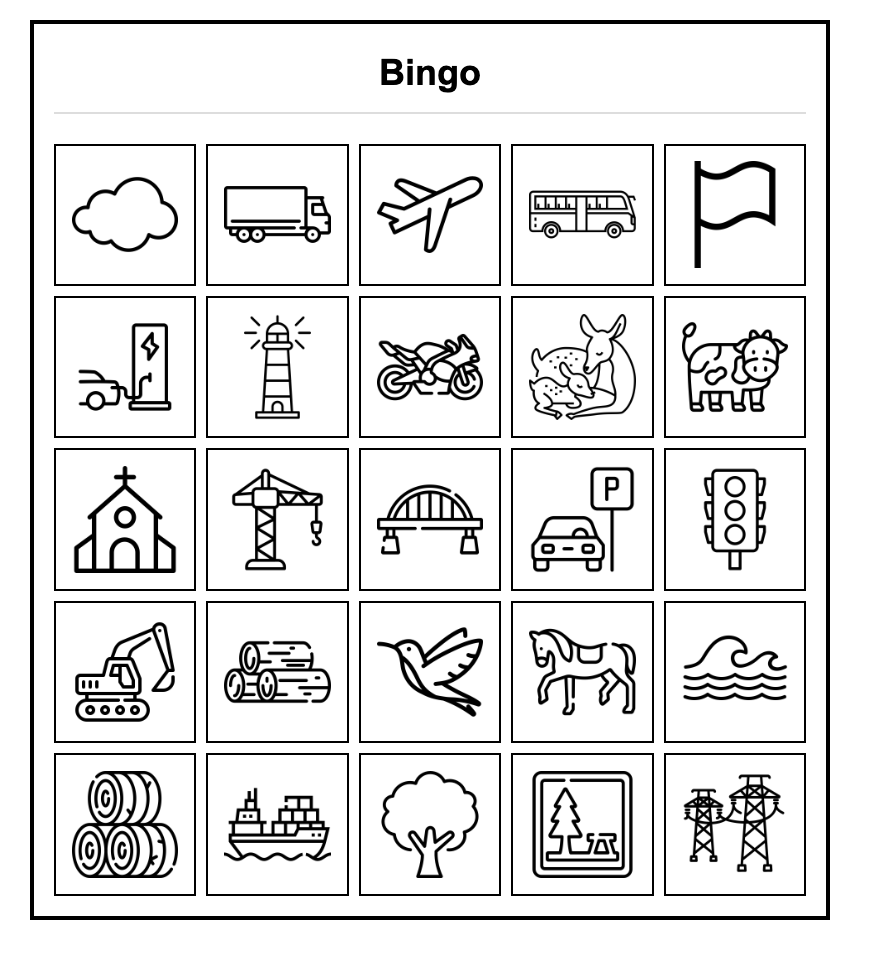

# Road Trip Bingo Generator

A web-based tool for generating custom bingo cards with your own icons, perfect for road trips, travel games, or classroom activities.

## Features

- Create bingo cards in 3x3, 4x4, or 5x5 grid sizes
- Upload and manage your own custom icons
- Generate multiple sets of unique bingo cards
- Each set has a unique identifier
- Download as PDF for easy printing
- All data stored locally in your browser

## Screenshots

### Main Application Interface


### Icon Manager


### Example Generated Card


## How to Use

1. **Upload Icons**: Use the Icon Manager to upload your own image files
2. **Configure Your Cards**:
   - Enter a title for your bingo cards
   - Select a grid size (3x3, 4x4, or 5x5)
   - Choose how many sets to create (each set uses a different selection of icons)
   - Set how many cards per set you want to generate
3. **Generate Cards**: Click the "Generate Bingo Cards" button to create your bingo cards
4. **Download**: Click the "Download PDF" button to save your cards as a printable PDF file

## Set System Explained

A "set" is a unique selection of icons from your library. For example, with 50 icons and a 5x5 grid (requiring 25 icons per card):
- You can generate multiple sets, each using a different selection of 25 icons
- Each set will have a unique identifier based on the icons used
- Cards within the same set use the same icons but in different arrangements
- Different sets use different selections of icons (with at least one icon difference)

## Local Storage

The application uses your browser's local storage to save your uploaded icons. No data is sent to any server, keeping your content private and accessible even when offline.

## Icon Sources

Icons for your bingo cards can be found at [Flaticon](https://www.flaticon.com/), which offers a wide variety of free and premium icons suitable for bingo card creation.

## Browser Compatibility

This application works in modern browsers that support:
- HTML5
- ES6 JavaScript
- LocalStorage API
- FileReader API

## Development

To run this project locally, simply clone the repository and open the road-trip-bingo.html file in your browser - no server required.

```
git clone https://github.com/yourusername/road-trip-bingo.git
cd road-trip-bingo
open road-trip-bingo.html
```

## License

This project is licensed under the MIT License - see the [LICENSE.md](LICENSE.md) file for details.